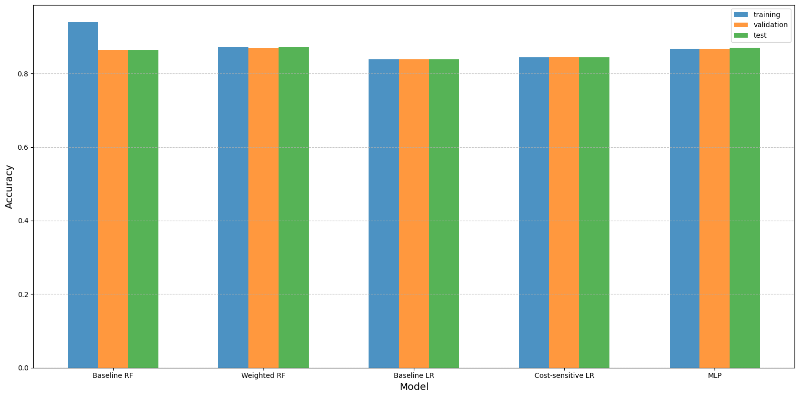
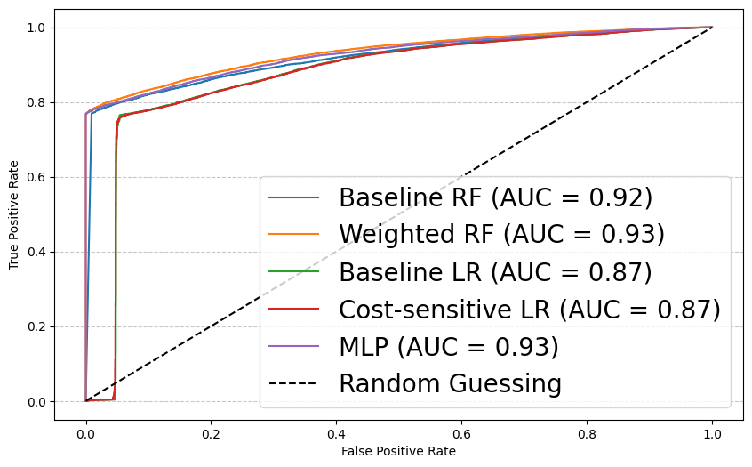

# About the project

# Task

Predict income and expenses for a holdout sample of ~10K users for the month of August based on a training sample of ~10K users from Februrary through July.

Based on your judgement of the usefulness of the results, either aggregate the data into incoming & outgoing flows, or predict based on the transaction type/category.

# what's included

```bash
income/
│── src/
│   ├── Dockerfile
│   ├── train_model.py
│   ├── preprocessing.py
│   ├── predict.py
│   │── plotter.py
│── example.ipynb
│── requirements.txt
│── setup.py
│── README.md
│── appendix.py
│── LRmodel.py
│── models/
│── result/
│── data/

```

- ```Dockerfile```: to creates a containerized environment for running `predict.py` and managing model predictions independently of system configurations
- ```train_model.py```: to train machine learning models used here and save them for later use in `predict.py`
- ```preprocessing.py```: for cleaning, transforming, and preparing data to be used in `train_model.py` and `predict.py`
- ```predict.py```:  loads trained models (.pkl files saved by `train_model.py`), applies preprocessing to new data (assuming this is august data), make predictions, and saves the results
- ```example.ipynb```: shows how to use the code in the jupyter
- ```requirements.txt/setup.py```: required packages to be installed before running the code. if you're using Dockerfile, only requirements.txt is relevant. if you dont want to use dockerfile, run setup.py
- ```README.md```: is this file you're currently reading
- ```appendix.py```: save metrics in a file.
- ```LRmodel.py```: implement the baseline logisitic regression (LR) and Cost-sensitive LR
- ```plotter.py```: to plot the accuracies and auc
- ```models/```: the trained models are saved here
- ```result/```: the metrics from `plotter.py` are saved here
- ```data/```: contains the data (to be) used


# How to run the code

## running locally

All the dependencies needed to run the methods can be installed using ```setup.py```, in a pre-built ```conda``` environment. In particular, this script needs to be executed as:

```bash
python setup.py
```
next, you run:

```bash
python3 predict.py
```
and lastly, run to get your predictions
```bash
python3 predict.py --input "../data/2016-09-19_79351_training_july.csv"
```

This will save predictions in `./result/predictions_all_models.csv`.

## running with docker

assuming you have docker destop installed. Open the Docker Desktop application. Next, build the docker image by runing the following on your commandline

```bash
docker build --no-cache -t ml_predict_app .
```

and run the container with the following:

```bash
docker run -it \
  -v $(pwd)/data:/app/data \
  -v $(pwd)/models:/app/models \
  -v $(pwd)/result:/app/result \
  ml_predict_app
```

This will save predictions in `./result/predictions_all_models.csv`.

# Code details

## model

- `basline LR` : implement the LR method as baseline 
- `cost LR`: and in addition, we add penalties to the cost function to balance the target variable
- `baseline RF`: baseline RF assumes equal importance for all classes, 
- `weighted RF`: and the weighted approach introduces class weights to modify the splitting criteria of the labels to prioritize minority class
- `MLP`: basline mlp is a feedforward neural network consisting of fully connected neurons with nonlinear activation functions

## parameters:

- `class_weight`: in the weighted RF, changes to `class_weight` will modify the outcome of the model. after some experiments, the class weight is set as `class_weight={0:1.45, 1:1.0}`
- `max_depth`: the maximum depth of the tree
- `n_estimator`: higher (lower) `n_estimator` could increase (reduce) model accuracy
- weights on LR: to tune the model sensitivity to imbalanced response feature, use `weight_positive=1.` and  `weight_negative=1.45`. these values are thesame as in `class_weight`
- `hidden_layer_sizes`: The ith element represents the number of neurons in the ith hidden layer.
- `activation`: activation function for the hidden layer. other options are {identity, logistic, tanh}.
- `solver`: the solver for weight optimization. other options to try are `lbfgs` and `sgd`.

# Metrics

### Model accuracy
<p align="center" width=10%>
<br>
</p>

### AUC curve
<p align="center" width=10%>
<br>
</p>

# Contact
You can reachout here [Abdullahi Adinoyi Ibrahim](https://github.com/aadinoyiibrahim)